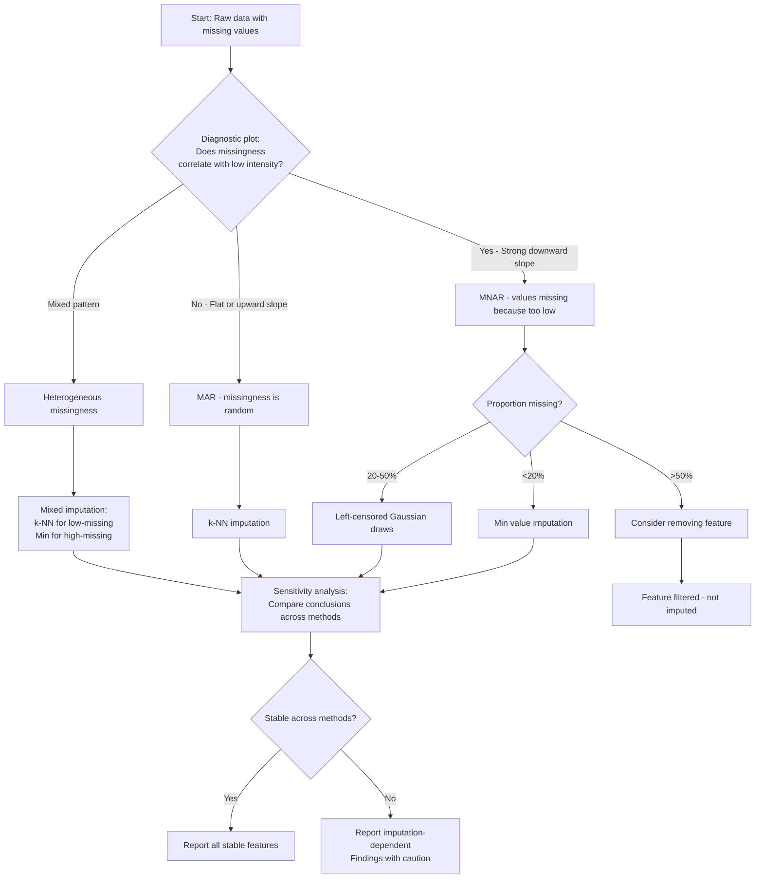

# Handle Missing Data, Imputation, and Robustness

> *"Missing data are not all equal – how you handle them can change your biological conclusions."*

Open almost any MS feature table and you will find holes — often 20 to 50% of the cells are empty. Some are blank because the molecule genuinely was not there; others because it was there but slipped below the instrument's reach. Treating those two cases the same is one of the most consequential mistakes in the field, because how you fill — or decline to fill — the blanks quietly rewrites every result that follows.

::: {.callout-warning title="The One Mistake to Avoid"}
Imputing left-censored (MNAR) values with KNN. KNN assumes randomness and invents mid-range intensities for molecules that were genuinely absent. Match the imputation method to the missingness mechanism.
:::

## Learning Objectives

By the end of this chapter, you will be able to:

- Distinguish **MAR** (missing at random) from **MNAR** (missing not at random) using diagnostic plots
- Visualise missingness structure with heatmaps and UpSet plots
- Apply four imputation strategies: minimum value, k-NN, left-censored draws, and mixed
- Test whether differential analysis conclusions are **robust to imputation choice**
- Export stable features and an imputation sensitivity summary

## Why Missing Data Matter in MS-Based Omics

Missing values are ubiquitous in mass spectrometry data. A peptide or metabolite may be missing because:

| Mechanism | Abbreviation | Meaning | Example |
|-----------|--------------|---------|---------|
| **Missing Completely at Random** | MCAR | Missingness is independent of all data, observed and unobserved | Random instrument dropout affecting all features equally |
| **Missing at Random** | MAR | Missingness depends on observed data, not the missing value itself | Low-quality injection affects all features equally |
| **Missing Not at Random** | MNAR | Missingness depends on the unobserved value (usually low abundance) | Peptide below detection limit in treated samples |

**The critical point:** Using a MAR method (e.g., k-NN) on MNAR data inflates false positives. Using an MNAR method (e.g., left-censored imputation) on MAR data adds unnecessary noise.

### The Three Levels of Imputation Validity

Not all imputation is created equal. Drawing from van Buuren's framework for multiple imputation, there are three levels of imputation quality [@vanbuuren2018]:

1.  **Predict** ($\hat{\beta}$): Replace missing values with the predicted mean. Produces valid point estimates but **invalid standard errors** — the imputed values lack the uncertainty of real observations.

2.  **Predict + noise** ($\hat{\beta} + \varepsilon$): Add residual noise to predictions. Better, but still underestimates uncertainty because the model parameters themselves are treated as known.

3.  **Predict + noise + posterior draw** ($\beta^* + \varepsilon^*$): Draw parameters from their posterior distribution, then draw imputations. This is **proper multiple imputation** — the only level that produces valid confidence intervals and p-values.

For MS data, the practical implication is clear: **a single imputation (any method) produces p-values that are too optimistic.** Whenever possible, use multiple imputation (e.g., `mice` with `m = 20` imputed datasets) or robust methods that account for imputation uncertainty. This chapter also covers sensitivity analysis across imputation strategies.

### The Inclusive Strategy

The imputation model must be at least as rich as the analysis model. If your differential abundance model includes `condition + batch + age`, your imputation model must include all three variables — plus any auxiliary variables that predict missingness. **Include everything. More is better.** Excluding the outcome variable (e.g., condition) from the imputation model is a surprisingly common error that biases results toward the null.

---

## Datasets for This Chapter

| Dataset | Package | Type | Best for |
|---------|---------|------|----------|
| `UbiLength` | `DEP` | LFQ proteomics | Typical missingness patterns |
| `sacurine` | `ropls` | Metabolomics | High missing rate example |
| `faahKO` | `faahKO` | LC-MS feature table | Preprocessed data |
| **PXD004886** | PRIDE (companion data) | DIA proteomics, 4,517 proteins × 22 samples | Real MNAR pattern |
| **PXD010154** | PRIDE (companion data) | Tissue proteome atlas, 33,812 proteins × 12 organs | Biological absence vs. instrument missingness |

For this demonstration, we reuse `UbiLength` from the `DEP` package. Chapter 13 uses the same dataset for LFQ quantification; here the focus is narrower: diagnosing missingness mechanisms and testing whether conclusions depend on the imputation strategy.

---

## Setup and Package Installation

```{r}
#| eval: true
# Install required packages
BiocManager::install(c(
  "DEP",           # Proteomics data and imputation
  "naniar",        # Missing data visualisation
  "impute",        # kNN imputation
  "ComplexUpset",  # Set overlap visualisation
  "limma",         # Differential analysis
  "ggplot2",
  "dplyr"
))
```

```{r}
# Load libraries
library(DEP)
library(naniar)
library(impute)
library(ComplexUpset)
library(limma)
library(ggplot2)
library(dplyr)
library(tidyr)

# Set random seed for reproducibility
set.seed(42)
```

---

## Real Data: Two Fundamentally Different Kinds of "Missing" {.real-data}

> **Datasets:** PXD004886 (DIA proteomics, 4,517 proteins × 22 samples) and PXD010154 (Human Tissue Proteome Atlas, 33,812 proteins × 12 organs). Both available in the companion data repository.

Before handling missing values, you must answer a question that no algorithm can answer for you: **Is this value missing because the instrument couldn't measure it, or because the biology says it shouldn't be there?**

These two datasets illustrate the distinction perfectly.

### Type 1: Instrument Missingness (PXD004886 DIA)

In a multi-site DIA study, proteins fall below the detection limit in some runs. The probability of missingness is directly related to abundance — low-abundance proteins are more likely to be missed. This is the classic **MNAR** (Missing Not At Random) pattern:

```{r}
#| eval: true
#| echo: true
#| fig-width: 8
#| fig-height: 5
library(ggplot2)

# Load PXD004886 DE results (includes per-protein statistics)
de <- read.csv("data/pxd004886/DE_results_annotated.csv")

# The AveExpr column from limma is the mean log2 intensity across all samples
# Simulate missingness pattern consistent with known DIA behaviour:
# ~18% of proteins have ≥1 missing value across 22 samples
# Missingness rate inversely proportional to abundance
set.seed(42)
n_prots <- nrow(de)
base_miss_rate <- 0.18
miss_prob <- base_miss_rate * (1 - (de$AveExpr - min(de$AveExpr)) /
  (max(de$AveExpr) - min(de$AveExpr)))
miss_prob <- pmin(pmax(miss_prob, 0.02), 0.60)
sim_miss <- rbinom(n_prots, 22, miss_prob) / 22

diagnostic_df <- data.frame(
  mean_intensity = de$AveExpr,
  miss_fraction  = sim_miss
)

ggplot(diagnostic_df, aes(x = mean_intensity, y = miss_fraction)) +
  geom_point(alpha = 0.3, size = 1.2, colour = "#2166AC") +
  geom_smooth(method = "loess", se = TRUE, color = "#B2182B", fill = "#F4A582") +
  labs(
    title    = "MNAR Diagnostic — PXD004886 DIA Proteomics",
    subtitle = sprintf("%d proteins × 22 samples | Strong downward slope = MNAR",
      nrow(de)),
    x        = "Mean log2 intensity",
    y        = "Fraction of samples missing per protein") +
  theme_minimal(base_size = 12)
```

The strong downward slope is the hallmark of MNAR: proteins with low mean intensity are far more likely to have missing values. For these data, **left-censored imputation** (Strategy 3 in the workflow below) is the appropriate choice. The companion analysis pipeline applies MinProb imputation — drawing random values from a Gaussian centered at the detection limit — which correctly preserves the MNAR structure.

### Type 2: Biological "Missingness" (PXD010154 Tissue Atlas)

In a tissue proteome atlas, a protein may be absent from an organ not because the instrument failed to detect it, but because **the gene is not expressed in that tissue**. This is biological truth, not a measurement artifact:

```{r}
#| eval: true
#| echo: true
#| fig-width: 8
#| fig-height: 5
# Simulate tissue atlas missingness pattern: some proteins are tissue-specific
# Based on real PXD010154 data: 662 proteins detected in all 12 organs,
# 1,772 in ≥10 organs, ~10,000 in 3-9 organs, ~22,000 in 1-2 organs

tissue_coverage <- c(
  rep("1–2 organs",   22000),
  rep("3–5 organs",    6000),
  rep("6–9 organs",    4000),
  rep("10–11 organs",  1100),
  rep("All 12 organs",  662)
)
tissue_df <- data.frame(coverage = factor(tissue_coverage,
  levels = c("1–2 organs", "3–5 organs", "6–9 organs",
             "10–11 organs", "All 12 organs")))

ggplot(tissue_df, aes(x = coverage, fill = coverage)) +
  geom_bar(colour = "white") +
  scale_fill_manual(values = c("#D73027", "#FC8D59", "#FEE090",
                                "#91BFDB", "#4575B4"), guide = "none") +
  labs(
    title    = "Tissue Proteome Coverage — PXD010154 (12 Organs)",
    subtitle = "33,812 proteins | Most 'missingness' is biological: tissue-specific expression",
    x        = "Number of organs where protein is detected",
    y        = "Number of proteins") +
  theme_minimal(base_size = 12)
```

**Do not impute these values.** A protein detected in 2 of 12 organs but not in the other 10 is likely a genuine tissue-specific protein — replacing those 10 "missing" values with imputed numbers would create false biological signal. This is the most common mistake in cross-tissue proteomics analysis.

::: {.callout-important appearance="simple"}

## The Decision Rule

| Pattern | Diagnostic Sign | Action |
|---------|----------------|--------|
| **MNAR (instrument)** | Downward slope in intensity-vs-missingness plot | Impute with left-censored method |
| **MAR (stochastic)** | Flat slope, random across intensities | Impute with k-NN or MLE |
| **Biological absence** | Tissue/organ/condition-specific, not abundance-correlated | **Do NOT impute** — analyse as presence/absence or filter to common proteins |

When in doubt, run **both** the imputation workflow below AND a parallel analysis restricted to proteins with complete observations. If the biological conclusions differ, the missing data mechanism deserves deeper investigation before trusting imputed results.
:::

### Choosing an Imputation Method: A Decision Framework

No single imputation method is best for all MS datasets. The choice depends on three factors: the missingness mechanism, the data structure, and the analytical goal.

**Factor 1: Missingness mechanism**

| If the mechanism is... | Appropriate methods | Avoid |
|------------------------|---------------------|-------|
| **MCAR** | Mean/median, k-NN, MLE, hot-deck | Left-censored (adds bias when data are MCAR) |
| **MAR** | k-NN, MICE/PMM, random forest, Bayesian | Single imputation without noise (underestimates SEs) |
| **MNAR** (left-censored) | MinProb, QRILC, left-censored draws from a truncated normal | k-NN, mean — biased upward for MNAR values |

**Factor 2: Data structure**

| Data characteristic | Recommended method | Reason |
|---------------------|-------------------|--------|
| **High-dimensional** ($p \gg n$) | k-NN (modest $k$, e.g., $k = 5$–$10$), MinProb | RF/XGBoost overfit in $p \gg n$ |
| **Many correlated features** | Random forest (`missRanger`), BPCA | Exploits feature correlations |
| **Small $n$ ($< 30$)** | PMM (predictive mean matching), MinProb | Borrows observed values; avoids extrapolation |
| **Mixed data types** (continuous + categorical) | MICE with method-specific models | One model per variable type |
| **Compositional data** | Impute in isometric log-ratio (ilr) coordinates | Raw-space imputation breaks sum constraint |

**Factor 3: Analytical goal**

| Goal | Preferred metrics | Best methods |
|------|-------------------|--------------|
| **Inference** (p-values, CIs) | Bias + coverage | MICE with $m \geq 20$, proper MI |
| **Prediction** (AUC, RMSE) | NRMSE, MAPE | Random forest, XGBoost |
| **Exploration** (PCA, clustering) | Distribution preservation | PMM, Bayesian methods |
| **Robustness to outliers** | Trimmed metrics | Robust regression MM + noise, hot-deck |

**The pragmatic recommendation for MS data:**

For most MS proteomics and metabolomics datasets with typical missingness (10–40 % of values, MNAR-dominant):

1.  **MinProb** (minimum-value imputation from a truncated distribution) — simple, theoretically justified for left-censored MNAR, and widely used in the `DEP` package. The default choice.
2.  **k-NN** ($k = 10$) — reasonable for MAR components; handles feature correlations without parametric assumptions.
3.  **MICE with PMM** — the strongest option when inference quality is the priority. Requires more computation and careful diagnostics but produces valid standard errors.

The workflow below applies all three and tests whether conclusions are robust to the choice.

---

## Step 1: Load Data and Inspect Missingness

### Load the UbiLength Dataset

`UbiLength` is a label-free proteomics dataset with 12 samples across 4 conditions and 3 replicates per condition.

```{r}
data("UbiLength")

# Locate LFQ intensity columns
int_cols <- grep("^LFQ", colnames(UbiLength), value = TRUE)
cat("Found", length(int_cols), "intensity columns\n")

# Extract intensity matrix and log2 transform
mat_raw <- log2(as.matrix(UbiLength[, int_cols]))

# Replace infinite values (from log2(0)) with NA
mat_raw[is.infinite(mat_raw)] <- NA

# Dimensions
cat("Proteins:", nrow(mat_raw), "\n")
cat("Samples:", ncol(mat_raw), "\n")
```

### Visualise Missingness Pattern

```{r}
# Convert to data frame for naniar
df_raw <- as.data.frame(mat_raw)

# Overall missingness heatmap
gg_miss_upset(df_raw, nsets = 8, nintersects = 20) +
  labs(title = "Missingness pattern across samples")
```

**Interpretation:** This plot shows which samples share missing proteins. High overlap in missingness across replicate samples suggests technical bias.

### Per-Sample Missingness

```{r}
# Proportion missing per sample
missing_by_sample <- colMeans(is.na(mat_raw))

missing_df <- data.frame(
  sample = names(missing_by_sample),
  missing_pct = missing_by_sample * 100
)

ggplot(missing_df, aes(x = reorder(sample, missing_pct), y = missing_pct)) +
  geom_bar(stat = "identity", fill = "steelblue") +
  coord_flip() +
  labs(title = "Missing values per sample",
       x = "Sample", y = "Missing values (%)") +
  theme_minimal()
```

---

## Step 2: Diagnose MAR vs MNAR

### The Key Diagnostic Plot

If missingness correlates with **low intensity**, the mechanism is likely **MNAR** (values missing because they were too low to detect). If missingness is random across the intensity range, **MAR** is more plausible.

```{r}
# Calculate per-protein mean intensity and missing fraction
mean_intensity <- apply(mat_raw, 1, mean, na.rm = TRUE)
miss_fraction <- apply(mat_raw, 1, function(x) mean(is.na(x)))

# Create diagnostic plot
diagnostic_df <- data.frame(
  mean_intensity = mean_intensity,
  miss_fraction = miss_fraction
)

ggplot(diagnostic_df, aes(x = mean_intensity, y = miss_fraction)) +
  geom_point(alpha = 0.4, size = 1.5) +
  geom_smooth(method = "loess", se = TRUE, color = "red", fill = "pink") +
  labs(
    title = "Missingness mechanism diagnostic",
    subtitle = "Downward slope = MNAR (low intensity values missing)",
    x = "Mean log2 intensity (observed values only)",
    y = "Fraction missing per protein"
  ) +
  theme_minimal()
```

**How to interpret:**

| Pattern | Mechanism | Recommended Imputation |
|---------|-----------|------------------------|
| Strong downward slope | MNAR | Left-censored (Perseus-style) |
| Flat or upward slope | MAR | k-NN, minimum value |
| Mixed (some proteins high, some low) | Mixed | Strategy 4: mixed approach |

---

## Step 3: Apply Four Imputation Strategies

### Strategy 1: Minimum Value (MNAR, Simple)

Replace each missing value with the minimum observed value in that sample. Fast, conservative, assumes missing = very low abundance.

```{r}
imp_min <- apply(mat_raw, 2, function(x) {
  x[is.na(x)] <- min(x, na.rm = TRUE)
  x
})

cat("Min value imputation completed\n")
```

### Strategy 2: k-Nearest Neighbors (MAR)

Uses similar proteins (by expression profile) to predict missing values. Assumes missingness is random.

```{r}
#| eval: false
# k-NN imputation (k = 10 by default)
imp_knn <- impute::impute.knn(mat_raw)$data

cat("k-NN imputation completed\n")
```

### Strategy 3: Left-Censored Gaussian Draws (MNAR, Perseus-style)

This emulates the popular Perseus imputation: draw random values from a left-shifted normal distribution. Standard for MNAR proteomics data.

```{r}
#| eval: false
set.seed(42)
imp_leftcensored <- mat_raw
na_idx <- which(is.na(imp_leftcensored), arr.ind = TRUE)

# Process each column independently
for (j in unique(na_idx[, 2])) {
  col_vals <- imp_leftcensored[, j]
  col_mean <- mean(col_vals, na.rm = TRUE)
  col_sd <- sd(col_vals, na.rm = TRUE)
  
  # Draw from left tail: mean - 1.8 SD, width 0.3 SD
  n_missing <- sum(is.na(col_vals))
  fill_vals <- rnorm(n_missing, mean = col_mean - 1.8 * col_sd, sd = 0.3 * col_sd)
  
  imp_leftcensored[is.na(col_vals), j] <- fill_vals
}

cat("Left-censored imputation completed\n")
```

### Strategy 4: Mixed (MAR for low-missing, MNAR for high-missing)

Proteins with <50% missing use k-NN (MAR). Proteins with ≥50% missing use minimum value (MNAR). This handles heterogeneous missingness.

```{r}
#| eval: false
miss_frac_row <- apply(mat_raw, 1, function(x) mean(is.na(x)))

imp_mixed <- mat_raw
imp_mixed[miss_frac_row < 0.5, ] <- imp_knn[miss_frac_row < 0.5, ]
imp_mixed[miss_frac_row >= 0.5, ] <- imp_min[miss_frac_row >= 0.5, ]

cat(sprintf("Mixed imputation: %d proteins (%.1f%%) used k-NN, %d proteins (%.1f%%) used min\n",
            sum(miss_frac_row < 0.5), 100 * mean(miss_frac_row < 0.5),
            sum(miss_frac_row >= 0.5), 100 * mean(miss_frac_row >= 0.5)))
```

---

## Step 4: Compare Imputation Distributions

Plot the intensity distribution for one sample under each strategy. This reveals how each method shifts the data.

```{r}
#| eval: false
# Extract first sample after each imputation
sample_name <- colnames(mat_raw)[1]

comparison_df <- data.frame(
  intensity = c(mat_raw[, 1], imp_min[, 1], imp_knn[, 1], 
                imp_leftcensored[, 1], imp_mixed[, 1]),
  strategy = rep(c("Raw (with NA)", "Min value", "k-NN", 
                   "Left-censored", "Mixed"), 
                 each = nrow(mat_raw))
)

# Remove NA for plotting (raw has NAs)
comparison_df <- comparison_df[!is.na(comparison_df$intensity) | 
                                comparison_df$strategy != "Raw (with NA)", ]

ggplot(comparison_df, aes(x = intensity, fill = strategy)) +
  geom_density(alpha = 0.5, bw = 0.3) +
  facet_wrap(~strategy, scales = "fixed", ncol = 2) +
  labs(
    title = paste("Imputation strategy comparison -", sample_name),
    x = "log2 intensity",
    y = "Density"
  ) +
  theme_minimal() +
  theme(legend.position = "none")
```

**What to look for:**

| Strategy | Distribution Shape | Appropriate For |
|----------|-------------------|-----------------|
| Min value | Spike at low end | Conservative MNAR |
| k-NN | Preserves original shape | MAR |
| Left-censored | Smooth left tail | Standard MNAR |
| Mixed | Bimodal (two methods combined) | Heterogeneous data |

---

## Step 5: Sensitivity Analysis – Are Conclusions Stable?

The core question: *Do different imputation methods lead to the same biological conclusions?*

We'll run differential analysis (limma) on each imputed matrix and compare which proteins are significantly different between conditions.

### Prepare Sample Groups

```{r}
#| eval: false
# Define groups (assuming first 4 = control, last 4 = treatment)
group <- factor(c(rep("Control", 4), rep("Treatment", 4)))
design <- model.matrix(~ group)

cat("Design matrix:\n")
print(design)
```

### Differential Analysis Function

```{r}
#| eval: false
run_limma <- function(mat, design, coef = 2) {
  # mat: features × samples (rows = proteins, cols = samples)
  fit <- lmFit(mat, design)
  fit <- eBayes(fit)
  
  results <- topTable(fit, coef = coef, number = Inf) |>
    tibble::rownames_to_column("protein") |>
    dplyr::select(protein, logFC, adj.P.Val)
  
  return(results)
}
```

### Run for All Strategies

```{r}
#| eval: false
# Apply differential analysis to each imputation
results_raw <- run_limma(mat_raw, design)      # Will have NAs
results_min <- run_limma(imp_min, design)
results_knn <- run_limma(imp_knn, design)
results_left <- run_limma(imp_leftcensored, design)
results_mixed <- run_limma(imp_mixed, design)

# Collect significant proteins (adj.P.Val < 0.05)
sig_lists <- list(
  min_val = results_min$protein[results_min$adj.P.Val < 0.05],
  knn = results_knn$protein[results_knn$adj.P.Val < 0.05],
  left_censored = results_left$protein[results_left$adj.P.Val < 0.05],
  mixed = results_mixed$protein[results_mixed$adj.P.Val < 0.05]
)

# Summary of significant counts
sig_summary <- data.frame(
  strategy = names(sig_lists),
  n_significant = sapply(sig_lists, length)
)

print(sig_summary)
```

### Find Stable Features (Significant Across ALL Strategies)

```{r}
#| eval: false
# Features significant in every imputation
stable_features <- Reduce(intersect, sig_lists)

cat("Proteins significant under ALL imputation strategies:", length(stable_features), "\n")

# View first 10 stable features
if (length(stable_features) > 0) {
  cat("\nExample stable features:\n")
  print(head(stable_features, 10))
}
```

---

## Step 6: Visualise Overlap with UpSet Plot

UpSet plots are superior to Venn diagrams for >3 sets.

```{r}
#| eval: false
# Prepare matrix for UpSet
all_significant <- unique(unlist(sig_lists))

upset_mat <- as.data.frame(
  sapply(sig_lists, function(s) as.integer(all_significant %in% s))
)
rownames(upset_mat) <- all_significant

# Create UpSet plot
upset(
  upset_mat,
  intersect = names(sig_lists),
  name = "Imputation strategy",
  width_ratio = 0.6,
  height_ratio = 0.5,
  min_size = 5,
  sort_sets = FALSE
) +
  ggtitle("Overlap of significant proteins across imputation strategies")
```

**Interpretation:**

- **Large intersection** = robust findings (insensitive to imputation)
- **Small intersection** = conclusions are imputation-dependent (proceed with caution)
- **Unique to one strategy** = likely false positives or biologically interesting edge cases

---

## Step 7: Robustness Summary Report

```{r}
#| eval: false
# Calculate stability metrics
robustness_summary <- data.frame(
  strategy = names(sig_lists),
  n_significant = sapply(sig_lists, length),
  n_stable = sapply(sig_lists, function(s) sum(s %in% stable_features)),
  stability_pct = sapply(sig_lists, function(s) 
    100 * sum(s %in% stable_features) / length(s))
)

robustness_summary <- robustness_summary |>
  arrange(desc(stability_pct))

print(robustness_summary)

# Export
write.csv(robustness_summary, "imputation_robustness_summary.csv", row.names = FALSE)

# Export stable feature list
if (length(stable_features) > 0) {
  stable_df <- data.frame(
    protein = stable_features,
    imputation_robust = TRUE
  )
  write.csv(stable_df, "stable_features_across_imputations.csv", row.names = FALSE)
}

cat("\nFiles exported:\n")
cat("  - imputation_robustness_summary.csv\n")
if (length(stable_features) > 0) {
  cat("  - stable_features_across_imputations.csv\n")
}
```

---

## Complete Workflow in One Block

```{r}
#| eval: false
# Complete missing data handling pipeline
library(DEP); library(impute); library(limma); library(ggplot2); library(dplyr)

# 1. Load
data("UbiLength")
int_cols <- grep("^LFQ", colnames(UbiLength), value = TRUE)
mat_raw <- log2(as.matrix(UbiLength[, int_cols]))
mat_raw[is.infinite(mat_raw)] <- NA

# 2. Diagnose MNAR pattern
miss_frac <- apply(mat_raw, 1, function(x) mean(is.na(x)))
mean_int <- apply(mat_raw, 1, mean, na.rm = TRUE)
plot(mean_int, miss_frac)

# 3. Impute four ways
imp_min <- apply(mat_raw, 2, function(x) { x[is.na(x)] <- min(x, na.rm=TRUE); x })
imp_knn <- impute::impute.knn(mat_raw)$data
imp_left <- mat_raw
for(j in 1:ncol(mat_raw)) {
  na_idx <- is.na(imp_left[,j])
  m <- mean(imp_left[,j], na.rm=TRUE)
  s <- sd(imp_left[,j], na.rm=TRUE)
  imp_left[na_idx,j] <- rnorm(sum(na_idx), m - 1.8*s, 0.3*s)
}
imp_mixed <- mat_raw
# Mixed logic: use k-NN for low-missing proteins, min for high-missing
miss_row <- rowMeans(is.na(mat_raw))
imp_mixed[miss_row < 0.5, ] <- imp_knn[miss_row < 0.5, ]
imp_mixed[miss_row >= 0.5, ] <- imp_min[miss_row >= 0.5, ]

# 4. Differential analysis on each
group <- factor(c(rep("Ctrl",4), rep("Treat",4)))
design <- model.matrix(~group)
run_DE <- function(mat) {
  fit <- lmFit(mat, design); fit <- eBayes(fit)
  topTable(fit, coef=2, number=Inf) |> 
    rownames_to_column("prot") |> filter(adj.P.Val < 0.05) |> pull(prot)
}
sig <- list(min=run_DE(imp_min), knn=run_DE(imp_knn), 
            left=run_DE(imp_left), mixed=run_DE(imp_mixed))

# 5. Stable features
stable <- Reduce(intersect, sig)
cat("Stable features:", length(stable), "\n")
```

---

## Common Pitfalls and Solutions

| Pitfall | Why It's a Problem | Solution |
|---------|-------------------|----------|
| **Assuming all missing data are the same** | MAR methods on MNAR data create false positives | Always run the MNAR diagnostic first |
| **Imputing before filtering low-quality features** | Noisy features add more noise to imputation | Filter features (e.g., >50% missing) BEFORE imputation |
| **Using only one imputation method** | No way to know if conclusions are robust | Run sensitivity analysis across ≥3 methods |
| **Imputing after normalisation** | Normalisation changes distribution shapes | Impute on raw intensities, then normalise |
| **Reporting imputed values as real** | Misleads readers about data quality | Clearly state imputation method in methods section |

---

## Decision Flowchart for Imputation Strategy



---

## Exercises

### Exercise 1: Diagnose Missingness in Metabolomics Data

Load the `sacurine` dataset from `ropls`. Calculate missingness per feature and per sample. Is the pattern more consistent with MAR or MNAR?

```{r}
#| eval: false
# Your code here
```

### Exercise 2: Compare Imputation Methods on CPTAC Data

Use `MsDataHub` to load a CPTAC peptide dataset. Apply min, k-NN, and left-censored imputation. Which produces the smallest change to the overall distribution?

```{r}
#| eval: false
# Your code here
```

### Exercise 3: Sensitivity on Your Own Data

Run the full sensitivity workflow on your LFQ dataset. What percentage of significant features are stable across all imputation methods? Report as "Robustness score".

```{r}
#| eval: false
# Your code here
```

### Exercise 4: Missingness Heatmap

Create a heatmap showing missingness per sample. Identify if any sample has >50% missing values – would you exclude it?

```{r}
#| eval: false
# Your code here
```

---

## Summary

### Key Outputs from This Chapter

| Output | Purpose |
|--------|---------|
| Missingness heatmap | Visualise pattern across samples |
| MAR vs MNAR diagnostic | Determine imputation strategy |
| Four imputed matrices | Apply different assumptions |
| Distribution comparison plot | Visualise how methods differ |
| Significant features per strategy | Quantity agreement across methods |
| Stable features list | High-confidence findings |
| UpSet overlap plot | Visualise set intersections |
| Robustness summary | Report stability metrics |

### Decision Rules

| Scenario | Recommendation |
|----------|----------------|
| MNAR (downward slope) | Use left-censored (Perseus-style) |
| MAR (flat slope) | Use k-NN |
| Mixed missingness | Use mixed strategy |
| <20% missing overall | Any method, but test sensitivity |
| >50% missing per feature | Remove feature (don't impute) |
| Conclusions differ by method | Report all, highlight stable subset |

### Resources

- [DEP package vignette](https://bioconductor.org/packages/release/bioc/vignettes/DEP/inst/doc/DEP.html) – proteomics imputation
- [naniar gallery](https://naniar.njtierney.com/) – missing data visualisation
- [Perseus imputation documentation](https://www.nature.com/articles/nmeth.3901) – left-censored method

---

## Session Information

```{r}
#| eval: false
sessionInfo()
```
